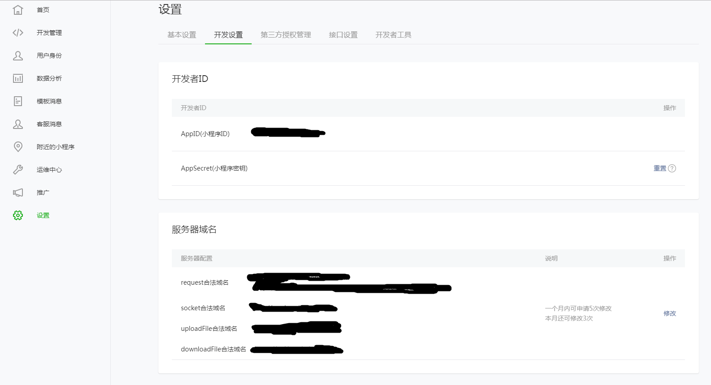
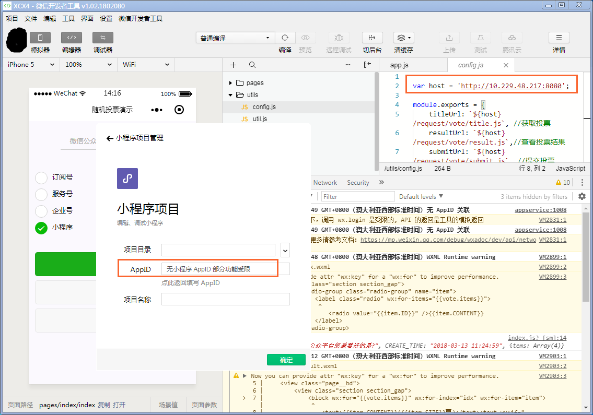
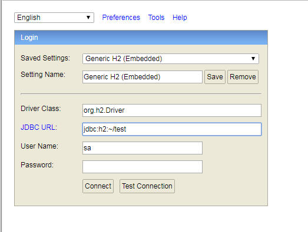
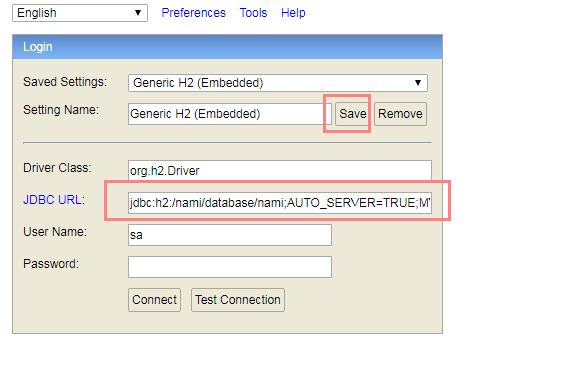
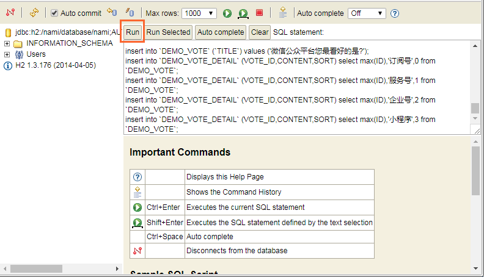
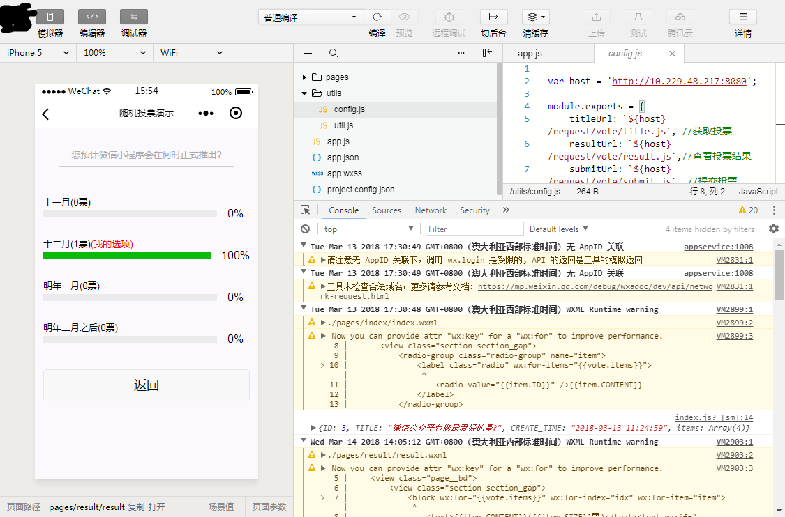

# CoNami小程序Demo端到端开发指南


## 1. 注册登录微信公众平台

登录https://mp.weixin.qq.com，里面有详细的指引，这里就不赘述了。这里注册最后得到的比较重要的东西包括两个



1. **设置-开发设置-开发者ID**：AppID/AppSecrect，后端服务器和微信API服务器认证用，也就是告诉微信，我是个合法的小程序后端，可以和你通信并调用登录支付API等
2. **设置-开发设置-服务器域名**：微信端测试/发布时，会校验这些域名是否实名认证并被备案，白名单。这个域名可以到腾讯云购买并备案，中间也会折腾一些时间。

## 2. 前端开发 

这次的开发Demo为一个投票用小程序，后端为tomcat+js+db框架，前端为标准的小程序前端，开发者不需要操心tomcat和db的服务，只需要用js编写业务逻辑即可。

Demo的github地址：

https://gitee.com/yingpo/weixin-xiaochengxu-vote

* 简单介绍下，app目录为前端代码，nami目录为后端代码和sql，都是由js编写
* 使用微信开发者工具打开`app`目录，在调试模式下如果没有备案的域名会导致前台无法访问后台，所以在启动开发者工具的时候可以不填写AppID，这样开发者工具不会校验域名是否在白名单里面
* 修改`/utils/config.js`, 设置后端运行的IP端口，然后进行编译



## 3. 后端开发部署

### 3.1 业务逻辑镜像制作及本地运行

登录并打开阿里云 容器镜像服务， 找到conami镜像，网页地址为：https://cr.console.aliyun.com/?spm=5176.166170.863063.btn1cr3.69f9217fdGki9I#/imageDesc/cn-qingdao/conami/conami/detail

0. 在windows下运行docker（可选）

由于微信小程序的前端IDE只支持windows，所以方便点最好在windows下跑个docker，可以看这个官方指导：https://docs.docker.com/docker-for-windows/install/

1. 下载及基础框架镜像

```
docker pull registry.cn-hangzhou.aliyuncs.com/conami/conami
```

2. **业务逻辑源代码出场！从框架基础镜像构建自己的业务逻辑**

```
git clone https://gitee.com/yingpo/weixin-xiaochengxu-vote.git

# 这里的Dockerfile显示了业务逻辑部分怎么拷进去，业务逻辑在/nami/request目录下
docker build -t myvote .

docker push myvote {你的镜像仓库地址}
```

3. 启动容器，初始化数据库

```
docker run -d -p 8080:8080 myvote 

# 默认的ENTRYPOINT为 bash /nami/service.sh start
```

* 在浏览器中访问 这个机器的数据库  http://10.229.48.217:8080/db，进入数据库控制台



* 这时候直接点Connect是进不去的，里面的jdbc的url需要修改为

```
jdbc:h2:/nami/database/nami;AUTO_SERVER=TRUE;MVCC=TRUE
```



可以点击Save把这个地址存下来，以后登录db不用再写

* 然后把weixin-xiaochengxu-vote/nami/sql目录里面的vote_demo.sql复制到这个数据库内执行，建表



至此，整个后端的小程序服务容器就已经跑起来了。在小程序开发者工具上，修改`app/utils/config.js`，把里面的host地址这行改为目前使用的服务器地址，可以正常进行投票、查看等操作




## 参考文档

[NAMI来了！五分钟让微信小程序接上数据库](https://mp.weixin.qq.com/s/M05_V7QecDZJMLZ_QPhHLA)


